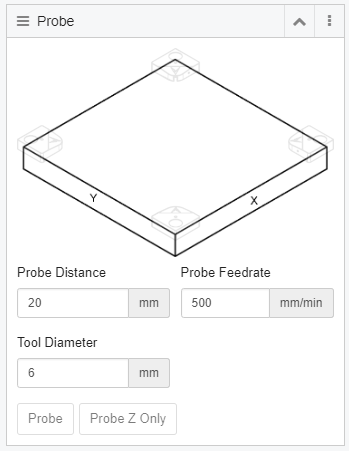

# Probe Widget

The probe widget is located on the right side of Gladius. This widget helps you use a touch plate to set your Work Coordinate System offsets. In order to use the "Probe XYZ" Function, you must have selected the correct corner you have placed the touch plate onto.

*picutre here for touch plate*

## XYZ Touch Plate
In order to set your first Work Place Coordinates (WCS in future reference) we have to use the XYZ Touch Plate. This will only work if you have already done a manual Tool Change function to set the first tool length with your Tool Probe. Plug the touch plate into the front of the machine.

Place the plate on the work piece and jog the spindle so that the tool is in the middle and about 15mm above the bottom of the pocket on the plate.

Inside Gladius, make sure you have the correct corner that you are probing, set in the probe screen. Make sure the correct tool diameter is set as well... otherwise this will cause you some grief 😊

Hit XYZ Probe to automatically start the probe function.

Video [here](https://youtu.be/dJzfIMFA8z4) of demo.