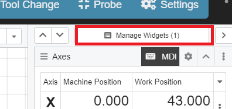
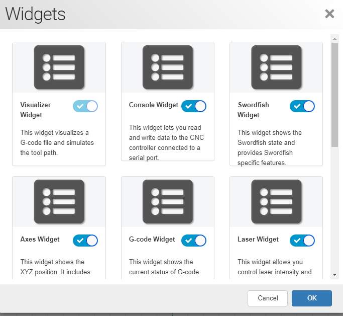

# Workspace

The workspace in Gladius is very similar to CNCjs. (put links here for cncjs stuff maybe explain how it works)

There are widgets located on the right or left side of Gladius screen.

You can enable pre-built widgets or create a custom widget on Gladius. This is found on the right side called "Manage Widgets"

