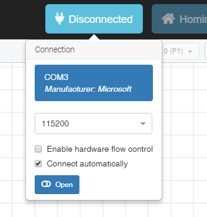
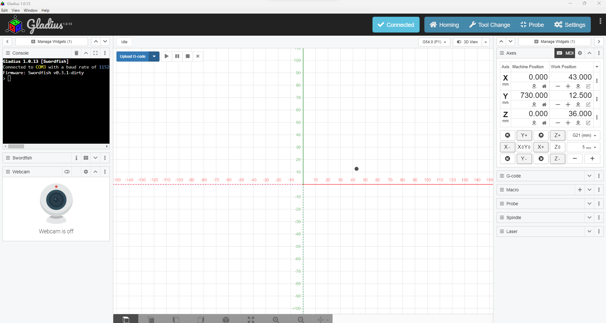

# Machine Startup

Turn on your Machine at the controller

Make sure the USB is connected to the Computer

## Connecting to the machine

    1. Open Gladius
    2. Click on the blue button "Disconnected" at the top right of Gladius. It will show a drop down menu.
    3. Select the com port that is connected to controller and hit "Open"

On the top left side of Gladius, the console should pop up with a black terminal and the "Disconnected" button should now be "Connected"

Before running up the machine we reccomend you follow the startup procedure and spindle warm up below.

## Startup Procedure

    Run a tool change to set machine work co-ordinates

### Homing the machine

Press the "Homing" button at the top right of Gladius to home the machine. The machine should start moving to it's home position.

Before running up the machine we reccomend you follow the startup procedure and spindle warm up below.

### Spindle Warmup

The warm up should be performed before use to increase the longevity of your machine. Each stage should be held for 120 seconds (two minutes).

    7,500 RPM
    9,000 RPM
    11,500 RPM
    15,000 RPM
    18,000 RPM

