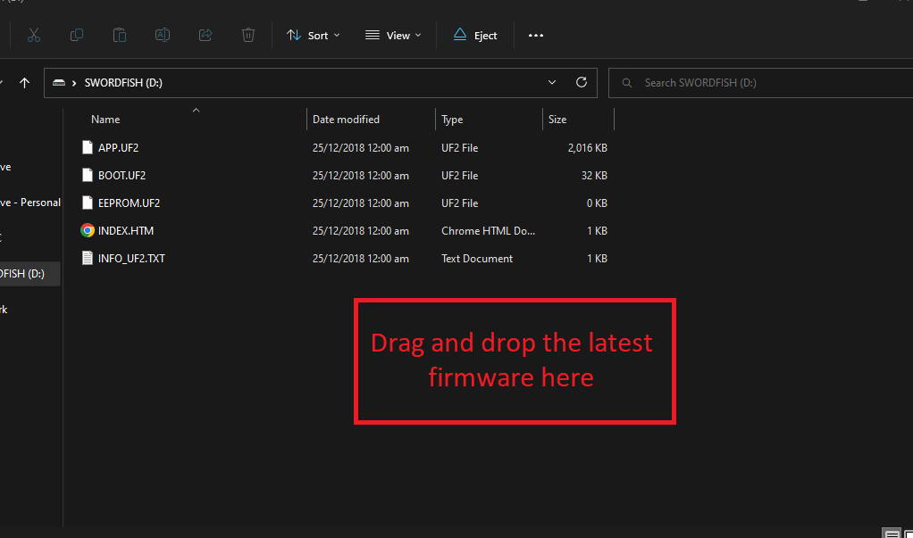

# Firmware

# Configuration Settings

# WARNING!!
**These functions are mainly designed for service technicians, or those that feel comfortable fiddling. If you are uncomfortable and are having issues with Gladius and the machine contact us for [support](https://zealandia.systems/pages/support).**

## Firmware update
In order to do a firmware update, you will need to enter M997 into the console in Gladius. Once you do this, the controller will restart and open a USB drive on your PC. Click and drag or copy and past this attached firmware file into the USB drive. Once complete, the controller will automatically reboot and install the update.

Latest firmware [here](https://github.com/Zealandia-Systems/Swordfish/releases)

## Explanation of JSON string format

*   M2000 is the Mcode for accessing the settings

*   O[function] is used for whether you are Creating a record, Reading, Updating or Deleting. Easily remembered by using the pnumonic, "CRUD"

O0 = Create,
O1 = Read,
O2 = Update,
O3 = Delete,

*   ?/[file directory]  is where the record is you wish to locate.

 *  >{[command]}  is the function/command you with to perform

## Enabling Automatic Tool Changer Function
    M2000 O2 ?/tooling >{"automatic":true}

## Configuring VFD and Spindle

### Changzou H100

    M2000 O0 ?/tooling/drivers/0 >{"type":0}

### Fuling DZB

    M2000 O0 ?/tooling/drivers/0 >{"type":1}

### Laser PWM Setup

    M2000 O0 ?/tooling/drivers/1 >{"type":2}

### CT100

    M2000 O0 ?/tooling/drivers/0 >{"type":4}

### Fuling H1

    M2000 O0 ?/tooling/drivers/0 >{"type":4}     

as well as the maximum rpm supported by the spindle:

### 18000 RPM

    M2000 O0 ?/tooling/driverParameters/0 >{"driver":0,"id":10,"value":18000}

### 24000 RPM

    M2000 O0 ?/tooling/driverParameters/0 >{"driver":0,"id":10,"value":24000}

### 60000 RPM

    M2000 O0 ?/tooling/driverParameters/0 >{"driver":0,"id":10,"value":60000}

### Laser is automatically scaled 0-100% on M3 

## Enable electric fan control

    M2000 O0 ?/tooling/driverParameters/1 >{"driver":0,"id":11,"value":"true"}

## Enable ATC Dust Shoe

    M2000 O2 ?/tooling >{"hasATCDustShoe":"true"}