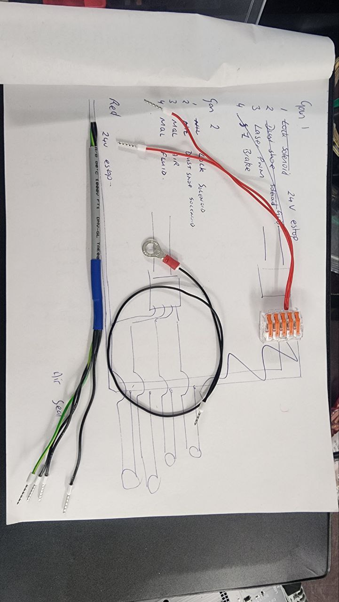
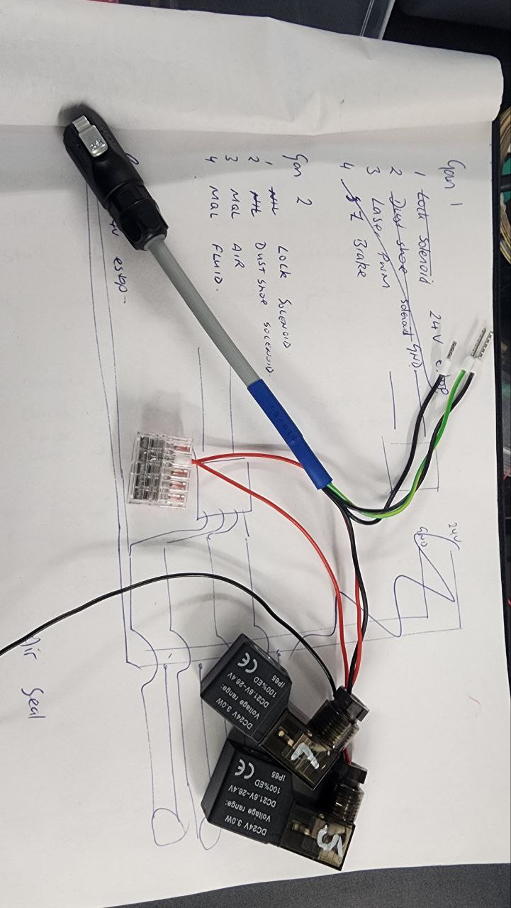

# Pneumatic Loom

Air seal is permantently wired into Postive, with the Negative cable going to the ring terminal, and grounding on the earth bond on the back of the Z main bracket.

Positive feed is the individual red wire, running off the 24V supply to the machine, to the top of the gantry.

Switching the negatives through the GAN2 loom.

|Cable|Description| 
|-|-|
| Gan 2 | | 
| 1 | Lock Solenoid | 
| 2 | Dust Shoe Solenoid |
| 3 | MQL Air Solenoid |
| 4 | MQL Fluid Solenoid |

