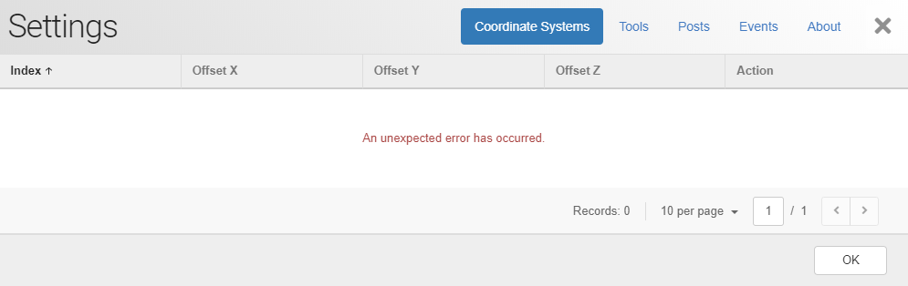

# Settings
Clicking on Settings will open up a tabbed UI. This shows work coordinate system, tools, post, events and about. 

*Note: If you are not connected to the machine, you will not be able to edit any machine based settings. Please ensure that you are connected to the machine and that the machine is responding to your commands - if there is a bug and the firmware has hung, please lodge a support ticket with [us](). Reset the controller by down powering and re-powering ensuring that the USB is also disconnected.*