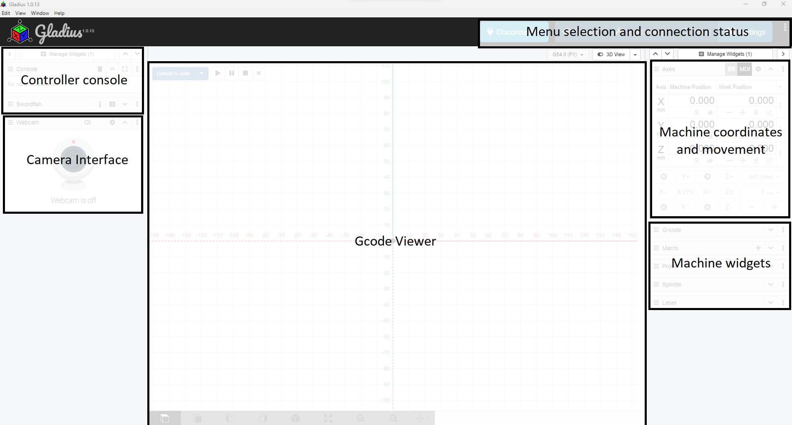

# User Interface

## Layout of the Application

### Controller Console
When connected this shows a terminal box of the controller. This can be used to see status and input Gcode commands. 

### Camera Interface
This is the camera interface where you can input a camera from the PC.

### Gcode Viewer
For viewing imported Gcode 0 can also view Gcode path 

### Menu selection and connection status
This is where quick buttons such as connection and machine homing

### Machine coordinates and movement
Workspace coordinates and machine movement buttons here

### Machine Widgets
Extra machine properties such as probing, spindle, laser, etc